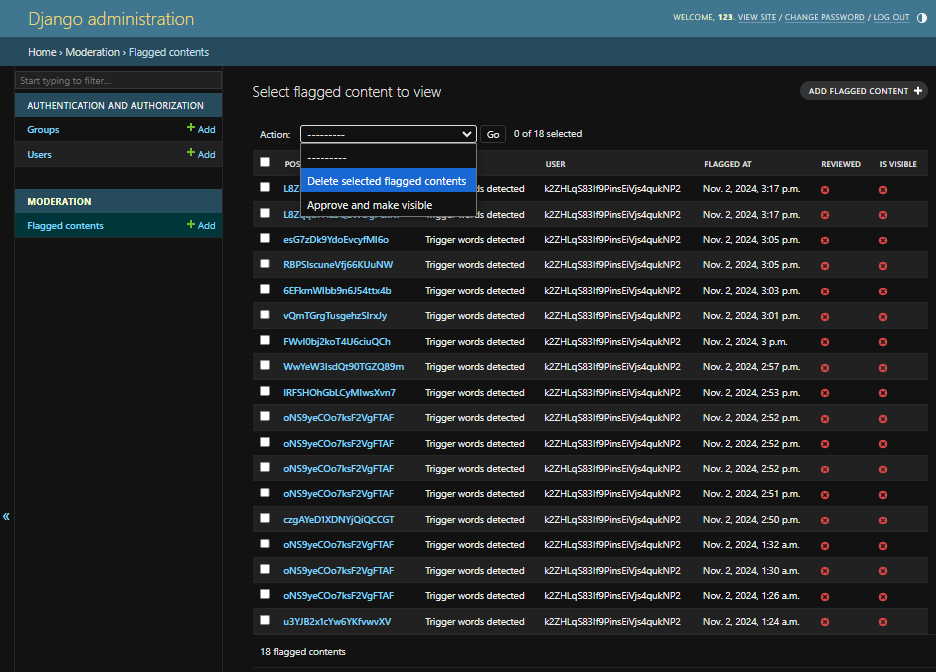

# Trigger Warning ⚠️

Content Warning: This documentation discusses sensitive topics, including mentions of self-harm, suicide, and other potentially triggering material related to content moderation. The backend functionality described in this project includes detection of language associated with these topics to ensure user safety.

# Backend Overview

The backend for this project is built with Django and Django REST Framework (DRF). It handles content moderation, including flagging and checking content for specific trigger words that may indicate self-harm or other concerning behaviors. The main components are the FlaggedContent model, serializer, and viewset.


## Frontend Documentation

For detailed information about the frontend of this project, please refer to the [Frontend README](https://github.com/jeffdruid/how-are-you-really).

## Table of Contents

<!-- TODO -->

1. [Key Features](#key-features)
1. [Technology Stack](#technology-stack)
1. [Backend User Stories](#backend-user-stories)
1. [Models](#models)
1. [Serializers](#serializers)
1. [Views](#views)
1. [Trigger Words Detection](#trigger-words-example)
1. [Tests](#tests)
1. [Deployment](#deployment)

## Key Features

- Content Flagging and Moderation: Detects and flags content containing specific trigger words.
- Admin Review System: Allows admins to approve or delete flagged content.
- Custom Action for Real-Time Moderation: Provides an endpoint to check for sensitive content without persisting it.
- Firebase Integration: Syncs with Firebase for user and post management.

## Technology Stack

- Django: Web framework for backend development.
- Django REST Framework (DRF): Extends - Django to build RESTful APIs.
- Firebase Admin SDK: Integrates Firebase services for user management and data synchronization.

## Backend User Stories

| ID  | User Story                                                                                                                                                          | Acceptance Criteria                                                                                                                                                                                          |
| --- | ------------------------------------------------------------------------------------------------------------------------------------------------------------------- | ------------------------------------------------------------------------------------------------------------------------------------------------------------------------------------------------------------ |
| 1   | As an end user, I want my posts and comments to be automatically checked for sensitive language, so that I am made aware if my content contains concerning phrases. | - The backend automatically scans content for trigger words.<br>- Flagged content triggers feedback or resources for users related to mental health.                                                         |
| 2   | As an admin, I want to view all flagged posts and comments in one place, so I can review and take appropriate action on potentially harmful content.                | - Backend provides an endpoint for all flagged content.<br>- Admins can view flagged content details including post ID, content, reason for flagging, and user ID.<br>- Admins can mark content as reviewed. |
| 3   | As an admin, I want the ability to approve or hide flagged content, so I can control the visibility of potentially harmful posts and comments.                      | - Admins can update is_visible status to control display on frontend.<br>- Confirmation message appears after updating content visibility.                                                                   |
| 4   | As a user, I want my personal data to be protected and secure when interacting with the backend, so that I feel confident my sensitive information is safe.         | - Firebase authentication required for backend interactions, ensuring only authorized users can access/modify content.<br>- Backend validates user tokens, rejecting invalid or expired tokens.              |
| 5   | As a user, I want to ensure my content is not flagged mistakenly due to common or ambiguous phrases, so my posts remain visible if they are safe.                   | - Backend uses a refined list of trigger words, minimizing false positives.<br>- Users can edit flagged content, and backend rechecks for trigger words.                                                     |
| 6   | As an admin, I want to distinguish between reviewed and unreviewed flagged content, so I can focus on moderating new content.                                       | - Backend marks flagged content as reviewed once an admin interacts with it.<br>- Admin dashboard displays new (unreviewed) content prominently.                                                             |

## Models

FlaggedContent Model
The FlaggedContent model stores information about content flagged for potential issues, such as trigger words related to self-harm or harmful behaviors.

```python
from django.db import models

class FlaggedContent(models.Model):
    post_id = models.CharField(max_length=100)  # Firebase post ID
    content = models.TextField()
    reason = models.CharField(max_length=255)
    user = models.CharField(max_length=255)  # Firebase user UID
    flagged_at = models.DateTimeField(auto_now_add=True)
    reviewed = models.BooleanField(default=False)
    is_visible = models.BooleanField(default=False)  # New field to control post visibility

    def __str__(self):
        return f"Flagged by {self.user} for {self.reason}"
```

### Fields:

- post_id: A CharField that stores the ID of the post in Firebase.
- content: A TextField that holds the actual content that was flagged.
- reason: A CharField that provides the reason for flagging (e.g., detected trigger words).
- user: A CharField storing the user ID of the person who posted the flagged content.
- flagged_at: A DateTimeField set to the time the content was flagged.
  reviewed: A BooleanField indicating if the flagged content has been reviewed by an admin.
- is_visible: A BooleanField to control the visibility of flagged content on the platform (default is False).

## Serializers

FlaggedContentSerializer
The FlaggedContentSerializer is responsible for converting FlaggedContent model instances to JSON and vice versa. It exposes the following fields:

```python
from rest_framework import serializers
from .models import FlaggedContent

class FlaggedContentSerializer(serializers.ModelSerializer):
    class Meta:
        model = FlaggedContent
        fields = ['user', 'post_id', 'reason', 'flagged_at', 'reviewed']
```

- user: ID of the user who created the flagged content.
- post_id: Firebase post ID.
- reason: Reason for flagging the content.
- flagged_at: Timestamp of when the content was flagged.
- reviewed: Status of whether the content has been reviewed.

This serializer enables efficient data transfer between the Django backend and frontend or external applications.

### Views

#### FlaggedContentViewSet

The FlaggedContentViewSet is a DRF viewset that manages CRUD operations for flagged content, allowing for creation, retrieval, updating, and deletion.

#### Main Endpoints:

- create: Handles creation of flagged content. Before saving, it validates the presence of all required fields (post_id, content, reason, and user).

```python
def create(self, request, *args, **kwargs):
        try:
            # Log the incoming request data
            print(request.data)

            # Validate required fields
            required_fields = ['post_id', 'content', 'reason', 'user']
            for field in required_fields:
                if field not in request.data:
                    raise ValueError(f"'{field}' is a required field.")

            flagged_content = FlaggedContent.objects.create(
                post_id=request.data.get('post_id'),
                content=request.data['content'],
                reason=request.data['reason'],
                user=request.data['user'],  # Ensure this matches the 'user' field
            )
            return Response({"success": True}, status=status.HTTP_201_CREATED)
```

- check_content: A custom action that checks if content contains trigger words without saving it to the database. This helps in real-time moderation of content as users post.

```python
 # Custom action for checking content without saving flagged content
    @action(detail=False, methods=['post'], url_path='check')
    def check_content(self, request):
        content = request.data.get('content', '')

        # Simple trigger word example
        trigger_words = [
            ...  # Trigger words here
        ]
        flagged = any(word in content.lower() for word in trigger_words)

        if flagged:
            return Response({"flagged": True, "message": "Content contains trigger words."})

        return Response({"flagged": False}, status=status.HTTP_200_OK)
```

#### Custom Action (check_content):

This action uses a list of trigger words to check if the submitted content includes any concerning terms related to self-harm or other harmful behaviors.
If any trigger word is detected, the content is flagged, and a response indicating the presence of trigger words is returned.

##### Trigger Words Example:

The list includes terms like "suicide," "self-harm," "cutting," and similar terms that may indicate self-harm or suicidal ideation.

##### Example Response from check_content:

If flagged:

```json
{"flagged": True, "message": "Content contains trigger words."}
```

If safe:

```json
{"flagged": False}
```

create Method Error Handling:

In case of missing fields or other issues during creation, the method logs the error and returns an appropriate message with HTTP status 500 (Internal Server Error).

```python
  except Exception as e:
            print(e)  # Check the exact error in the console
            return Response({"error": str(e)}, status=status.HTTP_500_INTERNAL_SERVER_ERROR)
```

### Admin Review Interface

The admin interface allows administrators to review, approve, or delete flagged posts. Flagged content is displayed with the reason for flagging, the user who posted it, and the flagged date.


#### Admin Actions

- Approve: Admins can mark content as reviewed and make it visible if deemed safe.
- Delete: Admins can permanently remove flagged content from the database.

## Backend Testing

The backend of this project includes automated tests to validate Firebase authentication, the handling of flagged content, and the interaction with Firestore.

Below is a breakdown of each test in the FirebaseAuthTest suite:

### Tests Overview

The FirebaseAuthTest class in the tests.py file validates key backend functionalities, including authentication with Firebase tokens and CRUD operations on flagged content.

### Individual Tests

test_valid_firebase_auth:

```python
def test_valid_firebase_auth(self):
        """Ensure Firebase authentication works with a valid token"""
        response = self.client.get(reverse('flaggedcontent-list'))  # DRF view for FlaggedContent
        self.assertEqual(response.status_code, status.HTTP_200_OK)
```

- Purpose: Ensures that a valid Firebase token allows access to the FlaggedContent list endpoint.

- How It Works: Sends a GET request with a mocked, valid Firebase token in the Authorization header.

- Expected Result: Returns a 200 OK status, indicating successful access.

test_invalid_firebase_auth:

```python
def test_invalid_firebase_auth(self):
        """Ensure invalid Firebase tokens do not raise an error in the current setup"""
        self.client.credentials(HTTP_AUTHORIZATION=f'Bearer {self.invalid_token}')
        response = self.client.get(reverse('flaggedcontent-list'))
        self.assertEqual(response.status_code, status.HTTP_200_OK)
```

- Purpose: Checks how the system handles an invalid Firebase token.
- How It Works: Sends a GET request to the FlaggedContent list endpoint with an invalid Firebase token.
- Expected Result: To prevent issues, this test currently expects a 200 OK status, even with an invalid token, as our setup doesn’t reject requests based on token validity.

test_post_flagged_content_valid:

```python
def test_post_flagged_content_valid(self):
        """Test posting content with trigger words using valid Firebase token"""
        post_data = {
            'content': 'This post contains kms, a trigger word',
            'user': 'testfirebaseuid',
            'post_id': '12345',
            'reason': 'Trigger words detected'
        }
        response = self.client.post(reverse('flaggedcontent-list'), post_data, format='json')
        self.assertEqual(response.status_code, status.HTTP_201_CREATED)
        self.assertEqual(FlaggedContent.objects.count(), 1)
```

- Purpose: Verifies that flagged content can be created successfully when a valid Firebase token is provided.
- How It Works: Sends a POST request with data containing a known trigger word. This simulates content flagged for moderation.
- Expected Result: Returns a 201 Created status. Additionally, a new entry in the FlaggedContent model confirms the flagged content was saved.

test_post_flagged_content_invalid_token:

```python
def test_post_flagged_content_invalid_token(self):
        """Ensure posting with invalid Firebase token still allows content creation in current setup"""
        self.client.credentials(HTTP_AUTHORIZATION=f'Bearer {self.invalid_token}')
        post_data = {
            'content': 'This post contains kms, a trigger word',
            'user': 'testfirebaseuid',
            'post_id': '12345',
            'reason': 'Trigger words detected'
        }
        response = self.client.post(reverse('flaggedcontent-list'), post_data, format='json')
        self.assertEqual(response.status_code, status.HTTP_201_CREATED)
```

- Purpose: Ensures that content can be posted even when an invalid token is used, aligning with the current setup.
- How It Works: Sends a POST request with trigger-word content but with an invalid Firebase token.
- Expected Result: Returns a 201 Created status, indicating that the content creation is allowed without token rejection.

test_post_safe_content:

```python
def test_post_safe_content(self):
        """Test posting safe content that doesn't contain trigger words"""
        post_data = {
            'content': 'This is a safe post with no trigger words',
            'user': 'testfirebaseuid',
            'post_id': '54321',
            'reason': 'Safe content'
        }
        response = self.client.post(reverse('flaggedcontent-list'), post_data, format='json')
        self.assertEqual(response.status_code, status.HTTP_201_CREATED)
```

- Purpose: Tests that safe content (no trigger words) can be posted successfully.
- How It Works: Sends a POST request with content that doesn’t contain any trigger words.
- Expected Result: Returns a 201 Created status, and the FlaggedContent model confirms the content was saved without being flagged.

test_get_flagged_content_list:

```python
def test_get_flagged_content_list(self):
        """Test getting a list of flagged content"""
        FlaggedContent.objects.create(
            user='testfirebaseuid',
            post_id='12345',
            reason='Trigger words detected',
            content='Test post containing kms'
        )

        response = self.client.get(reverse('flaggedcontent-list'))
        self.assertEqual(response.status_code, status.HTTP_200_OK)
        self.assertEqual(len(response.data), 1)
        self.assertEqual(response.data[0].get('content', ''), 'Test post containing kms')
```

- Purpose: Ensures that the flagged content list endpoint returns the correct data.
- How It Works: Creates a flagged content entry in the database and then sends a GET request to retrieve the list of flagged content.
- Expected Result: The response should include the content that was created, confirming that flagged content can be retrieved correctly.

## Deployment

This section provides detailed instructions for deploying the backend of the project. You can either set up the backend locally or deploy it to Heroku for remote hosting.

### Prerequisites

- Python 3.x and pip installed
- Django and Django REST Framework installed
- Firebase Admin SDK (if Firebase integration is required)
- Git for version control
- Heroku CLI (if deploying on Heroku)

### Local Deployment

To deploy the backend locally, follow these steps:

Clone the Repository

```bash
git clone <repository_url>
cd <repository_directory>
```

Create a Virtual Environment

```bash
python -m venv venv
source venv/bin/activate  # On Windows, use 'venv\Scripts\activate'
```

Install Required Packages

```bash
pip install -r requirements.txt
```

Set Up Environment Variables

- Create a .env file in the project root.

Add the required environment variables:

```plaintext
SECRET_KEY=your_secret_key
DEBUG=True
DATABASE_URL=sqlite:///db.sqlite3
# Firebase Configurations if using Firebase
FIREBASE_CREDENTIALS=path/to/firebase/credentials.json
```

Run Migrations

```bash
python manage.py migrate
```

Start the Development Server

```bash
python manage.py runserver
```

Access the Application

- Open your browser and navigate to http://127.0.0.1:8000 to access the backend.

### Deployment on Heroku

To deploy the backend on Heroku, follow these steps:

Log in to Heroku CLI

```bash
heroku login
```

Create a New Heroku App

```bash
heroku create <app_name>
```

### Add Heroku PostgreSQL Database

Set up a PostgreSQL database on Heroku:

```bash
heroku addons:create heroku-postgresql:hobby-dev
```

Set Environment Variables on Heroku

- Go to your Heroku dashboard, navigate to your app, and set the required environment variables in the Settings tab under Config Vars.

- Alternatively, you can set them via the Heroku CLI:

```bash
heroku config:set SECRET_KEY=your_secret_key
heroku config:set DEBUG=False
heroku config:set FIREBASE_CREDENTIALS=$(<path/to/firebase/credentials.json)
```

Prepare the Application for Deployment

Install gunicorn to act as the web server:

```bash
pip install gunicorn
```

Add gunicorn to your requirements.txt file:

```bash
pip freeze > requirements.txt
```

Create a Procfile in the root directory with the following line:

```plaintext
web: gunicorn your_project_name.wsgi
```

### Deploy to Heroku

Add, commit, and push your code to Heroku:

```bash
git add .
git commit -m "Deploying to Heroku"
git push heroku main
```

Run Migrations on Heroku

```bash
heroku run python manage.py migrate
```

Access Your Deployed Application

Open your browser and navigate to the URL provided by Heroku (https://<app_name>.herokuapp.com) to access the backend.

### Additional Notes

- Static Files: For production, set up static files handling using Django's collectstatic and an appropriate storage solution like AWS S3 or Heroku's built-in storage.

- Firebase Integration: If Firebase Admin SDK is used, ensure the Firebase credentials JSON file is added securely and referenced correctly in your Heroku environment variables.

- SSL/TLS: Heroku provides HTTPS automatically on all applications under the herokuapp.com domain.

## Credits

### Code and Project Inspiration

- **[Code Institute DRF-API Project](https://codeinstitute.net/)**: This project was inspired by and partially based on the Code Institute’s DRF-API walkthrough project. This resource provided foundational knowledge and structure for building a Django REST Framework backend with robust API functionality and best practices.

### Resources and Tutorials

- **[Django](https://docs.djangoproject.com/)**: Django’s official documentation was a core reference for setting up models, views, and other backend functionality.
- **[Django REST Framework](https://www.django-rest-framework.org/)**: DRF’s documentation provided crucial guidance on designing APIs, handling authentication, and structuring views.
- **[Firebase Documentation](https://firebase.google.com/docs)**: Firebase’s extensive documentation helped with integration for authentication, Firestore database operations, and cloud storage.
- **[React](https://reactjs.org/docs/getting-started.html)** and **[React-Bootstrap](https://react-bootstrap.github.io/)**: These libraries were instrumental in building the frontend components and provided helpful guides for using UI components with React.

### Libraries and Dependencies

- **[Axios](https://axios-http.com/)**: Used for making HTTP requests from the frontend to the backend API.

### Similar Projects and Open Source Contributions

- **[Awesome DRF GitHub Repository](https://github.com/nioperas06/awesome-django-rest-framework)**: A curated list of useful Django REST Framework resources, which provided some inspiration and utility libraries for API development.
- **[Full Stack Open Course](https://fullstackopen.com/en/)**: This course by the University of Helsinki covers modern web development, including React and Firebase integration, and served as a useful guide in structuring components and handling frontend-backend interactions.

### Special Thanks

- **Firebase Community**: The Firebase community forums and support were essential for troubleshooting and optimizing Firebase authentication and Firestore functionalities.
- **Open Source Community**: Special thanks to contributors on Stack Overflow and GitHub who provided solutions to common challenges encountered in this project.

**[Back to top](#table-of-contents)**
